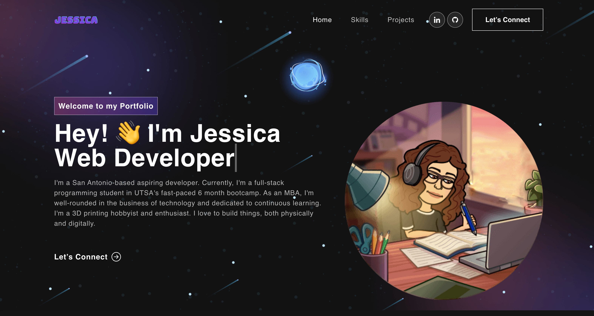

# My Professional Portfolio

## Table of Contents
* [Description](#description)
* [Built With](#languages)
* [Installation](#installation)
* [Contributing](#contributing)
* [Usage](#usage)
* [Questions](#questions)
* [Application Preview](#application-preview)

## [Description](#table-of-contents)
A professional portfolio to showcase my past projects, skills, resume, contact, and information about myself.

## [Languages](#table-of-contents)
React, JSX, Bootstrap

## [License](#table-of-contents)
The application is covered under the following license:  
    [MIT](https://choosealicense.com/licenses/MIT)

## [Usage](#table-of-contents)
Visit the live website at https://jessica-calderon.github.io/portfolio/

## [Contributing](#table-of-contents)

Thank you for your interest in contributing to this project, however, I am currently not accepting third party contributions.

## [Installation](#table-of-contents)
Visit live website at: https://jessica-calderon.github.io/portfolio/

## [Application Preview](#table-of-contents)
Click the image to see the website.

## [Questions](#table-of-contents)
Questions? Please contact me at the following links:  
[GitHub](https://github.com/jessica-calderon)  
[Email: calderonjessica13@yahoo.com](mailto:calderonjessica13@yahoo.com)
